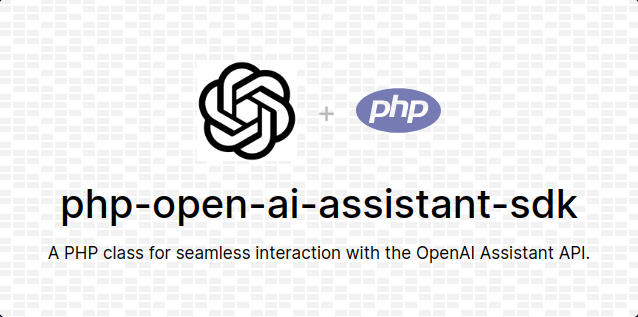

# OpenAI Assistant API PHP SDK

A PHP class for seamless interaction with the OpenAI Assistant API, enabling developers to build powerful AI assistants capable of performing a variety of tasks. <br>



## Table of Contents

- [Installation](#installation)
- [Usage](#usage)
- [Reference](#reference)
- [Feedback](#feedback)
- [License](#license)

## Installation

Install with composer

```bash
composer require erdum/php-open-ai-assistant-sdk
```

Or install without composer on older PHP versions just clone the project in your working directory and require the OpenAIAssistant.php
```bash
git clone https://github.com/erdum/php-open-ai-assistant-sdk.git
```

```php
<?php

require(__DIR__ . 'php-open-ai-assistant-sdk/src/OpenAIAssistant.php');

use Erdum\OpenAIAssistant;

$openai = new OpenAIAssistant(
    $api_key,
    $assistant_id
);
```
    
## Usage
Currently, this usage example does not contain any information about OpenAI Assistant API working for a better understanding of how OpenAI Assistant API works and its lifecycle please refer to the [OpenAI documentation](https://platform.openai.com/docs/assistants/how-it-works) and look inside the OpenAIAssistant.php file to see all the available methods.
```php
<?php

require(__DIR__ . '/vendor/autoload.php');
# require(__DIR__ . '/php-open-ai-assistant-sdk/src/OpenAIAssistant.php');

use Erdum\OpenAIAssistant;

$openai = new OpenAIAssistant(
    $api_key,
    $assistant_id
);

$thread_id = isset($_SESSION[$session_id]) ? $_SESSION[$session_id] : null;

if (empty($thread_id)) {
    $thread_id = $openai->create_thread($query);
    $_SESSION[$session_id] = $thread_id;
} else {
    $openai->add_message($thread_id, 'Can you help me?');
}
$openai->run_thread($thread_id);

while ($openai->has_tool_calls) {
    $outputs = $openai->execute_tools(
        $thread_id,
        $openai->tool_call_id
    );
    $openai->submit_tool_outputs(
        $thread_id,
        $openai->tool_call_id,
        $outputs
    );
}

// Get the last recent message
$message = $openai->list_messages($thread_id);
$message = $message[0];
$output = '';

if ($message['role'] == 'assistant') {
    foreach ($message['content'] as $msg) {
        $output .= "{$msg['text']['value']}\n";
    }
    exit($output);
}
```
### How PHP functions will be called

Whatever function names you provide in the tools array will be called in your PHP environment accordingly by the Assistant API, for example in the below code function "get_account_balance" should be present in your PHP environment in order to be executed. If you want to run methods of an object or static methods of a class then you can provide additonal argument to "execute_tools" method 
```php
<?php

// It will call the function directly whatever you have provided at the time of Assistant creation
$outputs = $openai->execute_tools(
    $thread_id,
    $openai->tool_call_id
);

// This will call methods on an instance of a class
$myObj = new MyAPI();
$outputs = $openai->execute_tools(
    $thread_id,
    $openai->tool_call_id,
    $myObj
);

// This will call static methods of a class
$outputs = $openai->execute_tools(
    $thread_id,
    $openai->tool_call_id,
    'MyAPI'
);

$openai->submit_tool_outputs(
    $thread_id,
    $openai->tool_call_id,
    $outputs
);
```
### Create a new Assistant
```php
<?php

require(__DIR__ . '/vendor/autoload.php');
# require(__DIR__ . '/php-open-ai-assistant-sdk/src/OpenAIAssistant.php');

use Erdum\OpenAIAssistant;

$openai = new OpenAIAssistant($api_key);

$openai->create_assistant(
    'Customer Support Assistant',
    'You are a customer support assistant of Telecom company. which is a wholesale DID numbers marketplace. You have to greet the customers and ask them how you can help them then understand their query and do the required operation. The functions and tools may require order-id in the arguments but do not ask the customers to provide their order-id because order-id will be included automatically to function calls.',
    array(
        array(
            'type' => 'function',
            'function' => array(
                'name' => 'get_account_balance',
                'description' => 'This function retrieves the account balance of the customer with the provided order-id.',
                'parameters' => array(
                    'type' => 'object',
                    'properties' => array(
                        'order_id' => array(
                            'type' => 'string',
                            'description' => 'The order-id of the customer.'
                        )
                    ),
                    'required' => array('order_id')
                ),
            )
        )
    )
);
```

## Reference

#### Constructor

| Parameter       | Type     | Description                                       |
| :-------------- | :------- | :------------------------------------------------ |
| `$api_key`      | `string` | **Required**. Your OpenAI API key.                |
| `$assistant_id` | `string` | Assistant ID (default = `null`).                  |
| `$base_url`     | `string` | OpenAI API base URL (default = 'https://api.openai.com/v1'). |
| `$version_header` | `string` | OpenAI API version header (default = 'OpenAI-Beta: assistants=v1'). |
| **Returns**     | `void`   | No return value.                                  |

#### `create_assistant`

| Parameter       | Type     | Description                                       |
| :-------------- | :------- | :------------------------------------------------ |
| `$name`         | `string` | Name of the assistant.                            |
| `$instructions` | `string` | Instructions for the assistant.                   |
| `$tools`        | `array`  | Array of tools.                                   |
| **Returns**     | `string` | ID of the created assistant.                      |

#### `modify_assistant`

| Parameter       | Type     | Description                                       |
| :-------------- | :------- | :------------------------------------------------ |
| `$name`         | `string` | Name of the assistant.                            |
| `$instructions` | `string` | Instructions for the assistant.                   |
| `$tools`        | `array`  | Array of tools.                                   |
| **Returns**     | `string` | ID of the modified assistant.                     |

#### `list_assistants`

No parameters.

| **Returns**     | `array`  | List of available assistants.                     |
| :-------------- | :------- | :------------------------------------------------ |

#### `create_thread`

| Parameter       | Type     | Description                                       |
| :-------------- | :------- | :------------------------------------------------ |
| `$content`      | `string` | Content of the thread.                            |
| `$role`         | `string` | Role (default = 'user').                          |
| **Returns**     | `string` | ID of the created thread.                         |

#### `get_thread`

| Parameter       | Type     | Description                                       |
| :-------------- | :------- | :------------------------------------------------ |
| `$thread_id`    | `string` | Thread ID.                                        |
| **Returns**     | `array`  | Details of the thread.                            |

#### `add_message`

| Parameter       | Type     | Description                                       |
| :-------------- | :------- | :------------------------------------------------ |
| `$thread_id`    | `string` | Thread ID.                                        |
| `$content`      | `string` | Content of the message.                           |
| `$role`         | `string` | Role (default = 'user').                          |
| **Returns**     | `string` | ID of the added message.                          |

#### `get_message`

| Parameter       | Type     | Description                                       |
| :-------------- | :------- | :------------------------------------------------ |
| `$thread_id`    | `string` | Thread ID.                                        |
| `$message_id`   | `string` | Message ID.                                       |
| **Returns**     | `array`  | Details of the message.                           |

#### `list_thread_messages`

| Parameter       | Type     | Description                                       |
| :-------------- | :------- | :------------------------------------------------ |
| `$thread_id`    | `string` | Thread ID.                                        |
| **Returns**     | `array`  | List of messages in the thread.                   |

#### `run_thread`

| Parameter       | Type     | Description                                       |
| :-------------- | :------- | :------------------------------------------------ |
| `$thread_id`    | `string` | Thread ID.                                        |
| **Returns**     | `string` | ID of the thread run.                             |

#### `execute_tools`

| Parameter           | Type     | Description                                       |
| :------------------ | :------- | :------------------------------------------------ |
| `$thread_id`        | `string` | Thread ID.                                        |
| `$execution_id`     | `string` | Execution ID.                                     |
| `$optional_object`  | `object` | Optional object.                                  |
| **Returns**         | `array`  | Outputs of executed tools.                        |

#### `submit_tool_outputs`

| Parameter           | Type     | Description                                       |
| :------------------ | :------- | :------------------------------------------------ |
| `$thread_id`        | `string` | Thread ID.                                        |
| `$execution_id`     | `string` | Execution ID.                                     |
| `$outputs`          | `array`  | Tool outputs array.                               |
| **Returns**         | `string` | ID of the submitted tool outputs.                 |


## Feedback

If you have any feedback, please reach out to us at erdumadnan@gmail.com

## License
[](https://choosealicense.com/licenses/mit/)
